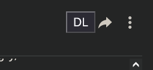
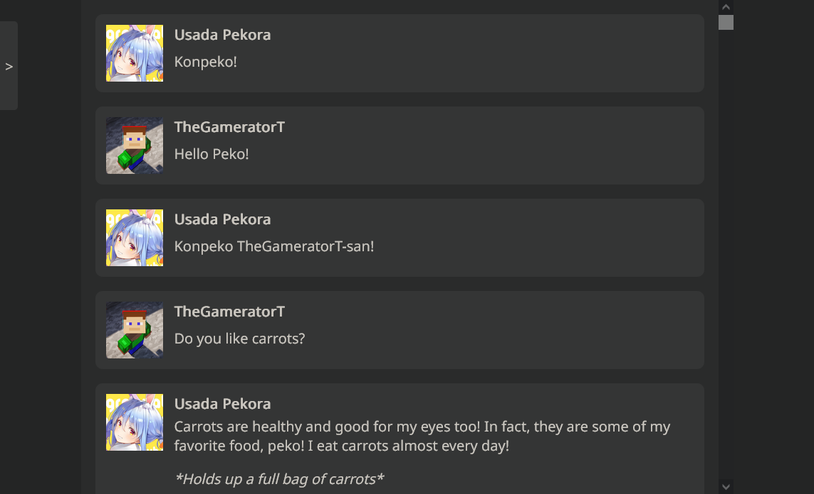

# CharacterAI Tools
A set of tools to dump and view dumps from CharacterAI (character.ai).

**IMPORTANT: The exporter does not yet support conversations with images and it requires for you to first scroll to the start of the convesation, otherwise not all messages will be saved!**

## Current tools
 - Exporter (Exports a conversation from CharacterAI)
 - Viewer (Displays an exported conversation)

## Installing the exporter

### Prerequisites

Install **Tampermonkey** **（[Chrome](https://www.tampermonkey.net/)** / **[Firefox](https://addons.mozilla.org/firefox/addon/tampermonkey/)** / **[Edge](https://microsoftedge.microsoft.com/addons/detail/tampermonkey/iikmkjmpaadaobahmlepeloendndfphd?hl=zh-CN)）**

### UserScript

Click [here](https://raw.githubusercontent.com/TheGameratorT/characterai-tools/main/characterai-export.js) to install the script.

## Installing the viewer

[Download](https://github.com/TheGameratorT/characterai-tools/archive/refs/heads/main.zip) this repository and after extracting it then navigate to `characterai-chat-viewer` then open the `index.html` file in your browser. You should now be able to drag in your conversation and view it.

## Previews

### Exporter

### Viewer

